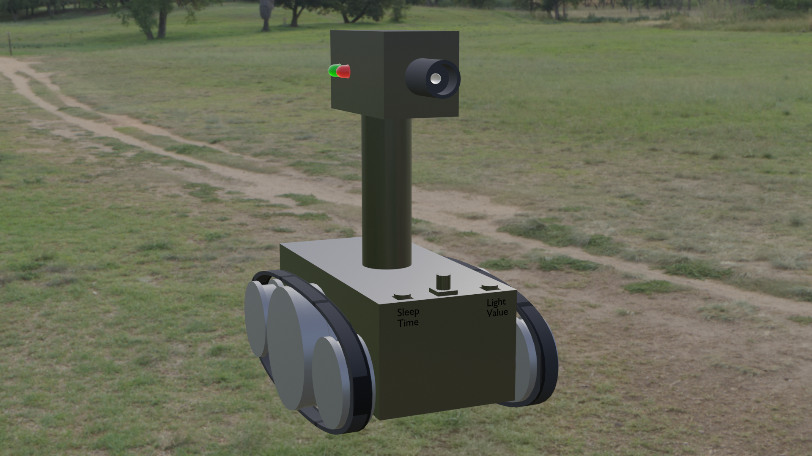
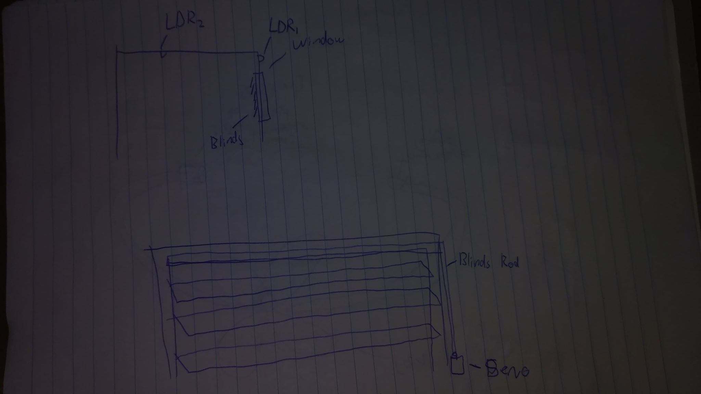
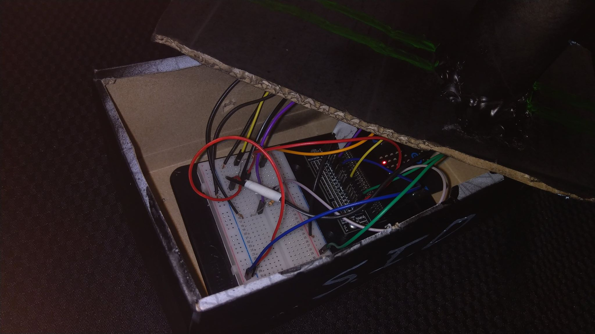

# 1701QCA Final project journal: *Jason Smart*

<!--- As for other assessments, fill out the following journal sections with information relevant to your project. --->

<!--- Markdown reference: https://guides.github.com/features/mastering-markdown/ --->

## Related projects ##

### Related project 1 ###
Butter Passing Robot


[Butter Passing Robot](http://www.youtube.com/watch?v=TZbxWvc9O6M)

This project is related to mine in its aesthetic and idea. The square shape, basic colour, and overcomplication of a simple task are very similar to my project.

### Related project 2 ###


[Microbit: Using a buzzer](https://learn.sparkfun.com/tutorials/sparkfun-inventors-kit-for-microbit-experiment-guide/experiment-9-using-a-buzzer)

This project is related to mine because it also uses a buzzer to make simple sounds and melodies. I can use the circuit diagrams to assist the design of my buzzer integration.

### Related project 3 ###
[Digital Watch](https://makecode.microbit.org/projects/watch/digital-watch)

```javascript
  let minutes = 0;
  basic.forever(() => {
      basic.pause(60000)
      if (minutes < 59) {
          minutes += 1;
      } else {
          minutes = 0;
      }
  })
```

This project is related to mine in its code execution. The project shown is to become a watch but I can utilize the time counting to play melodies at hour intervals. Because it is created on the microbit, I can sample the code and change it to suit my needs and it should fit perfectly.


### Related project 4 ###


[A Simple Light Follower](https://www.hackster.io/a-guadalupi/a-simple-light-follower-ad3388)

This project is related to mine in its because it also uses a photoresistor to detect light levels.

### Related project 5 ###


[Valentine's Sunflower](https://www.hackster.io/circuito-io-team/valentine-s-sunflower-3cdd90)

This project is related to mine in its because it also uses a photoresistor to detect light levels.


## Other research ##
<!--- Include here any other relevant research you have done. This might include identifying readings, tutorials, videos, technical documents, or other resources that have been helpful. For each particular source, add a comment or two about why it is relevant or what you have taken from it. You should include a reference or link to each of these resources. --->

I used the course reading "Prototyping Interactive Objects" by Scott Sullivan to identify the need for low level working code rather than complex, redundance free, production level code. Small prototypes of projects use simple code that outlines the functionality of the final product, made to be rewritten later. This allowed me to focus less of my time on writing the code and more on the documentation and construction of the project.

"Designers need to learn to code. They do not need to learn how to write production-level .NET web applications that are going to be pushed out to servers and used by millions of people. The type of coding that I’m referring to is a sketching medium that comes from a place of exploration, and it has very little to do with final implementation. This type of design coding is quick and dirty, relies heavily on frameworks, and is more about proof of concept than actually building a product that can scale up and be extended when needed." (Scott Sullivan, Prototyping Interactive Objects)

## Conceptual development ##

### Design intent ###
<!--- Include your design intent here. It should be about a 10 word phrase/sentence. --->
An interesting device that uses light detection to alert the user when it gets dark.

### Design ideation ###
<!--- Document your ideation process. This will include the design concepts presented for assessment 2. You can copy and paste that information here. --->
#### Design intent ####
*An interesting device that uses light detection for both functionality use and novelty.*


A quick 3D model of SID for conceptual design.

#### Design concept 1 ####
##### Automatic Fan Speed #####
The automatic fan speed device senses ambient room temperature to control the speed of the room's main fan. This keeps a controlled temperature environment within the room and increases circulation based on temperature.


#### Design concept 2 ####
##### Self Opening Blinds #####
Self opening blinds use a photoresistor placed outside the window that measures the light level outside. Once the light level reaches a certain threshold a motor is run to open the blinds to allow sufficient light in. The device could also use an internal photoresistor in conjunction with the external one to make sure the room is well lit enough from the inside. 




### Final design concept ###
<!--- This should be a description of your concept including its context, motivation, or other relevant information you used to decide on this concept. --->
The final design concept is a simple alarm which is light sensitive and activated when light drops below a specified level. The concept is based on the tendancy to be distracted by things to the point where the user doesn't realise what time of day it is. Generally people who are invested in computer based work or video games play past a point of sundown, when there are usually responsibilites that need to be completed at this time. Rather than a standard alarm clock, it is based as a novelty that would interest people that are usually interested in technology and video games, especially the science fiction world. It uses visual and audio features to alert the user of the ambient light levels. These features include blinking lights, body movement of the robot, and buzzing which could in future be translated to actual sounds through the use of a speaker rather than a buzzer. Because the robot is designed to be 'scared of the dark' it gives a personality to it and allows the user to connect. This provides a sense of companionship especially in current isolation. In future iterations speech could be added to further personify the device.

### Interaction flowchart ###
<!--- Include an interaction flowchart of the interaction process in your project. Make sure you think about all the stages of interaction step-by-step. Also make sure that you consider actions a user might take that aren't what you intend in an ideal use case. Insert an image of it below. It might just be a photo of a hand-drawn sketch, not a carefully drawn digital diagram. It just needs to be legible. --->


## Process documentation ##
<!--- In this section, include text and images (and potentially links to video) that represent the development of your project including sources you've found (URLs and written references), choices you've made, sketches you've done, iterations completed, materials you've investigated, and code samples. Use the markdown reference for help in formatting the material.

This should have quite a lot of information! It will likely include most of the process documentation from assessment 2 which can be copied and pasted here.

Use subheadings to structure this information. See https://guides.github.com/features/mastering-markdown/ for details of how to insert subheadings.

There will likely by a dozen or so images of the project under construction. The images should help explain why you've made the choices you've made as well as what you have done. --->

I've never been good at making things with my hands, which is why this project posed a difficult challenge to me. In the beginning prototyping stage I focused mostly on the fundamentals of the interaction by building smaller circuits and testing their ability to work.

The below code takes input from the LDR and compares it to a defined value (that will later be adjustable). If the room is too dark the tone is played and a motor spins. This gives proof of concept for further integration of movement in parts such as the continuous tracks. It also adds the ability to acknowledge the tone and make the device wait a predefined amount of time before it continues detecting light levels.  

```javascript
let light = 0;
let lightValue = 500;
pins.analogSetPitchPin(AnalogPin.P2)

basic.forever(function () {
    checkLight();
    if (input.buttonIsPressed(Button.A)) {
        pins.digitalWritePin(DigitalPin.P0, 0);
        basic.pause(60000);
    }
})

function checkLight() {
    light = pins.analogReadPin(AnalogPin.P1)

    if (light < lightValue) {
        music.playTone(1200, 1000);
        pins.digitalWritePin(DigitalPin.P0, 1)
    } else {
        pins.digitalWritePin(DigitalPin.P0, 0)
        return;
    }
}
```


This is an earlier version of this iteration where just the piezo buzzer is implemented. It used similar code, excluding the ability to wait.


Combining all iterations of this will bring the project closer to its full functionality, but to further refine it more commands will be separated into functions so that its more optimized and readable.

After getting these components to work properly I went to work on the physical body of the device. Due to limited resources and funds, I used household items such as cardboard to cosntruct the frame work. These were put together and painted black with some details to add aesthetic to the project. 



Initially, wheels were meant to be implemented into the design of the product but through experimentation, technical issues and time limitations, they were removed from the product.


## Final code ##

<!--- Include here screenshots of the final code you used in the project if it is done with block coding. If you have used javascript, micropython, C, or other code, include it as text formatted as code using a series of three backticks ` before and after the code block. See https://guides.github.com/features/mastering-markdown/ for more information about that formatting. --->

```javascript
let light = 0;
let lightThreshold = 20;
pins.analogSetPitchPin(AnalogPin.P2);

basic.forever(function () {
    checkLight();
})

function checkLight() {
    light = pins.analogReadPin(AnalogPin.P1)
    //if light level too dark play tone and turn LED on
    if (light < lightThreshold) {
        pins.digitalWritePin(DigitalPin.P0, 1);
        music.playTone(1200, 1000);
    } else {
        //otherwise turn led off
        pins.digitalWritePin(DigitalPin.P0, 0);
        return;
    }
}
```

## Reflection ##

<!--- Describe the parts of your project you felt were most successful and the parts that could have done with improvement, whether in terms of outcome, process, or understanding.

What techniques, approaches, skills, or information did you find useful from other sources (such as the related projects you identified earlier)?

What parts of your project do you feel are novel? This is IMPORTANT to help justify a key component of the assessment rubric.

What might be an interesting extension of this project? In what other contexts might this project be used? --->

The construction of the final model could definitely be of a higher standard but due to limited funds and resources the true concept of the project was not acheived. Ideally I would have used a 3D printing or metal CNC machining service to construct the parts out of a more sturdy, reliable, and aesthetic material. This would have saved time and stress by reducing manual labor and physical error, giving me more time to work on the functionality of the electronics. However the time spent working on the physical construction drew away from the overall effectiveness of the final product. 

Prior knowledge and assistance from the similary projects identified earlier allowed me to provide efficient and readable code to the microbit, increasing the level of usability and reasuability. The program is simple yet allows for the novel aspects of the device, such as its pseudo-personality to shine through in a performance optimised way.

Extending this product could turn it into a fully featured advanced alarm clock system that uses artificial intelligence to simulate a personality. This could be well marketed at children, especially those that have difficulty making friends, as the clock could provide some companionship. With more advanced technology like direction control and collision detection, the robot could move freely around the room performing tasks and holding conversations with the user. Conversation would not be an overly complicated feature to implement as chatbots have been in development [since the early 1960s](http://psych.fullerton.edu/mbirnbaum/psych101/Eliza.htm) and have only advanced in complexity and efficiency since then.

The device gains its novel aspect from its seemingly behavioural nature. When the ambient light in a room is too dark it screams, reminding the device's user to break away from common distractions that run into night when commitments and important tasks need to be fulfilled such as feeding pets, eating, and sleeping. The alarm system, meant to simulate screaming and distress from the robot, grabs the attention from the user and reminds them of the current time. This product would appeal mostly to gamers and people in the technology field, that already have an affinity for robots and technology, that have hobbies and occupations that often occupy them into the evening, letting them forget what time it actually is.  
